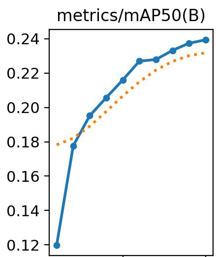
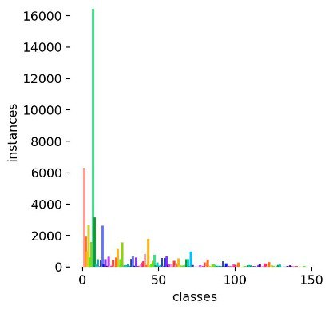
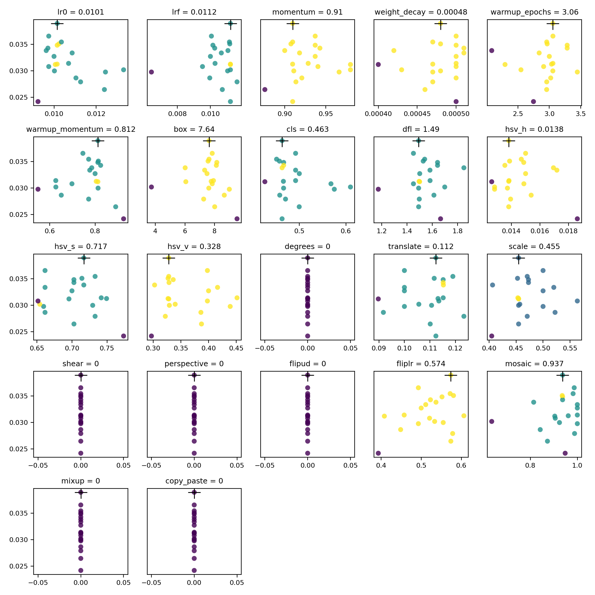

# Глубокое обучение на практике

## Первый кейс
Нами прототип помощника для водителей, который будет оповещать их о дорожных знаках. 
Прототип может быть запущен на мобильных устройствах, сравнение интерфейсов представлено ниже:

## Выбранная метрика -  mAP 0.5

MAP 0.5 - это средняя точность модели при пороге обнаружения 0.5. Это значит, что если модель обнаруживает дорожной знак с вероятностью более 0.5, то этот обнаруженный знак будет считаться правильным. 

Обоснование использования простое: мы хотим, чтобы модель как можно чаше распознавала дорожные знаки.
#### Заначение этой метрики у нас 0.24, график ниже:

Такой результат получен потому, что есть много похожих знаков (например, знак протяженности действия знака), при этом каждая протяженность считается за отдельный класс. Если заказчику нужно обязательно распознавать такие знаки, то в требованиях можно прописать, что необходимо увеличить число семплов таких знаков, либо же в дальнейшем при масштабировании перейти к композитной модели - например, распознавать категорию - что перед нами знак протяженности, и потом моделью для распознавания текста узнавать протяженность.

## ML эксперименты
Для выявления оптимальной модели для детекции дорожных знаков были проведены ряд экспериментов, с которым можно ознакомиться более [подробно](experiments/Experiments.ipynb)

#### YOLOv8n на 155 классах

Обучение проводилось на оригинальном датасете, который содержит 155 уникальных классов, распределение которых выглядит так:

При таких условиях результаты оказались крайне низкими.

#### YOLOv8n на 8 классах

Все дорожные знаки по ГОСТу делятся на 8 подгрупп. Основываясь на этой идее, результаты обучения возрасли в несколько раз.

##### Подбор гиперпараметров

Для подбора оптимальных гиперпараметров было осуществленно 20 итераций. Результаты на графиках.

## Сравнение инференса
Устройство: Raspberry Pi 4B (8 GB RAM, 1.5 GHz CPU)
| **Framework**  | **Model**   | **Image Size** | **Inference Time (ms)** | **FPS**   |
|------------|---------|------------|---------------------|-------|
|  PyTorch   | YOLOv8n | 640x640    | 1320.4201          | 0.76
|    **NCNN**    | **YOLOv8n** | **640x640**    | **534.2817**          | **1.87**
|     ORT    | YOLOv8n | 640x640    | 745.9199           | 1.34
|  OpenVINO  | YOLOv8n | 640x640    | 1036.2683          | 0.96

В MVP используется NCNN как демонстрирующий наибольшую производительность на ARM.

## Возможности масштабирования
- Перевод инференса на NPU (например, с помощью фреймворка RKNN от производителя Rockchip) - по данным Rockchip, производительность YOLOv8n на NPU достигает 14.4 FPS, а YOLOv8s - 6.8 FPS. Переход на YOLOv8s позволит существенно повысить точность распознавания;
- Переход на композитную модель: распознавание знаков + распознавание текста (множество знаков отличаются только текстом на них);
- Переезд с Ubuntu на Android - NCNN + Vulkan даёт кратный прирост производительности (на тестовом устройстве с Snapdragon 835 модель YOLOv8n в формате NCNN и использованием Vulkan API демонстрирует 14-20 FPS);

## Оценка всего решения
### Положительные моменты
#### Выбор метрики:

- Использование mAP 0.5 как метрики для оценки модели детекции дорожных знаков вполне обосновано, особенно в контексте нашего применения. Обоснование важности этой метрики также представлено.

#### Эксперименты и подбор гиперпараметров:

- Проведение экспериментов с различными моделями и количеством классов, а также подбор гиперпараметров, демонстрирует усилия по поиску оптимального решения.

#### Сравнение инференса:

- Развертывание на Raspberry Pi 4B и сравнение производительности различных фреймворков дает понимание того, как решение может работать в реальных условиях.

#### Возможности масштабирования:

- Выделение потенциальных шагов для улучшения производительности и масштабируемости решения, таких как перевод на NPU и использование композитных моделей, демонстрирует наши планы на будущее.

### Выполненные требования

## Качество кода
- [x] соблюдение pep8
- [x] Код заведен в github
- [x] код имеет понятную структуру
- [x] Код можно запустить

## Проведенные эксперименты 
- [x] Проведено сравнение разных моделей
- [x] Был произведен подбор гиперпараметров(оптимизатор, размер изображения, learning rate, число эпох, шедулер)
- [x] Выбраны и обоснованы ml метрики

## Обоснованность выбранного решения
- [x] произведена оценка производительности модели
- [x] произведена оценка качества всего решения
- [x] решение возможно масштабировать

## Второй кейс

To be continued...
