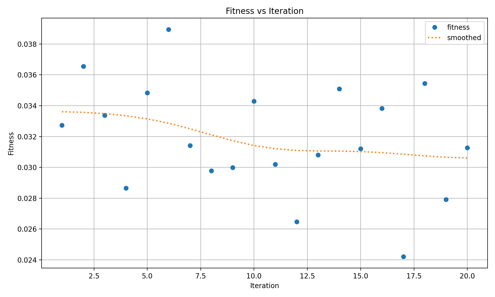

# Глубокое обучение на практике

## Первый кейс
Нами прототип помощника для водителей, который будет оповещать их о дорожных знаках. 
Прототип может быть запущен на мобильных устройствах, сравнение интерфейсов представлено ниже:

## ML эксперименты
Для выявления оптимальной модели для детекции дорожных знаков были проведены ряд экспериментов, с которым можно ознакомиться более [подробно](experiments/Experiments.ipynb)

#### YOLOv8n на 155 классах

Обучение проводилось на оригинальном датасете, который содержит 155 уникальных классов, распределение которых выглядит так:

При таких условиях результаты оказались крайне низкими.

#### YOLOv8n на 8 классах

Все дорожные знаки по ГОСТу делятся на 8 подгрупп. Основываясь на этой идее, результаты обучения возрасли в несколько раз.

##### Подбор гиперпараметров

Для подбора оптимальных гиперпараметров было осуществленно 20 итераций. Результаты на графиках.

## Сравнение инференса
Устройство: Raspberry Pi 4B (8 GB RAM, 1.5 GHz CPU)
| **Framework**  | **Model**   | **Image Size** | **Inference Time (ms)** | **FPS**   |
|------------|---------|------------|---------------------|-------|
|  PyTorch   | YOLOv8n | 640x640    | 1320.4201          | 0.76
|    **NCNN**    | **YOLOv8n** | **640x640**    | **534.2817**          | **1.87**
|     ORT    | YOLOv8n | 640x640    | 745.9199           | 1.34
|  OpenVINO  | YOLOv8n | 640x640    | 1036.2683          | 0.96

В MVP используется NCNN как демонстрирующий наибольшую производительность на ARM.

### Выполненные требования

## Качество кода
- [x] соблюдение pep8
- [x] Код заведен в github
- [x] код имеет понятную структуру
- [x] Код можно запустить

## Проведенные эксперименты 
- [x] Проведено сравнение разных моделей
- [x] Был произведен подбор гиперпараметров(оптимизатор, размер изображения, learning rate, число эпох, шедулер)
- [x] Выбраны и обоснованы ml метрики

## Обоснованность выбранного решения
- [x] произведена оценка производительности модели
- [x] произведена оценка качества всего решения
- [x] решение возможно масштабировать

## Второй кейс

To be continued...
